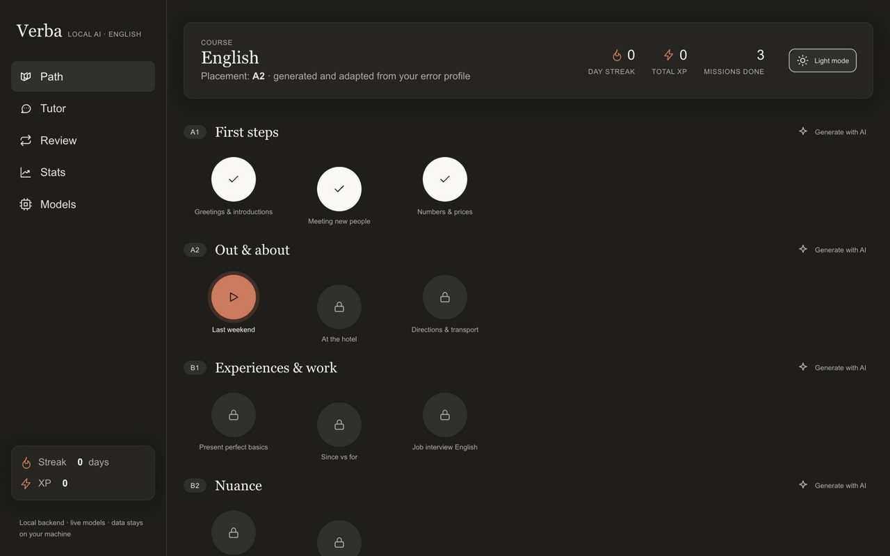
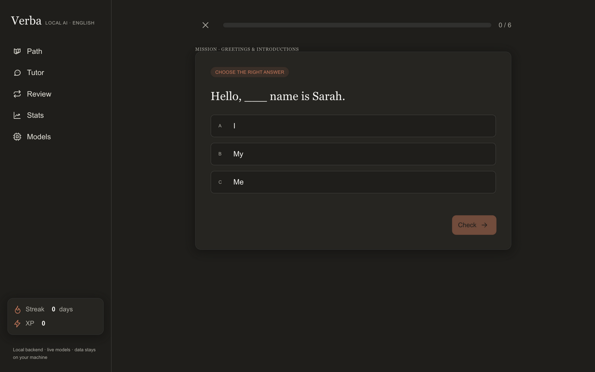
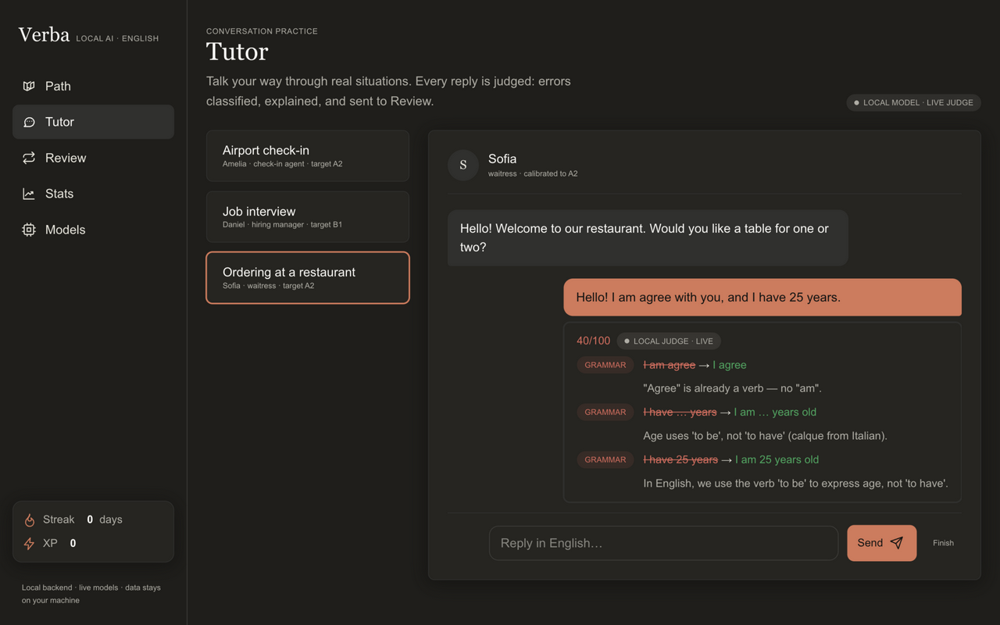
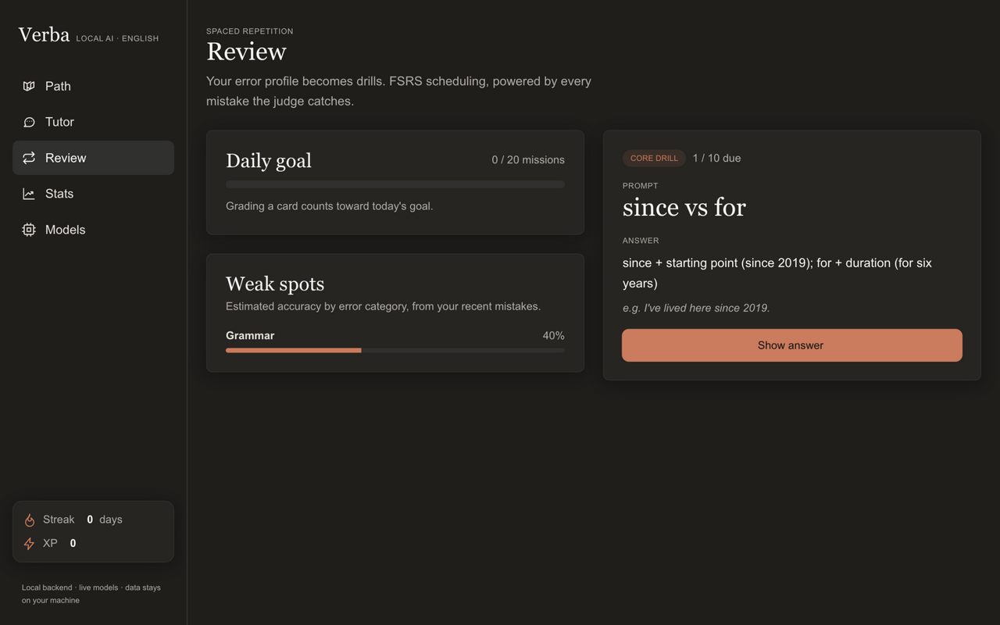
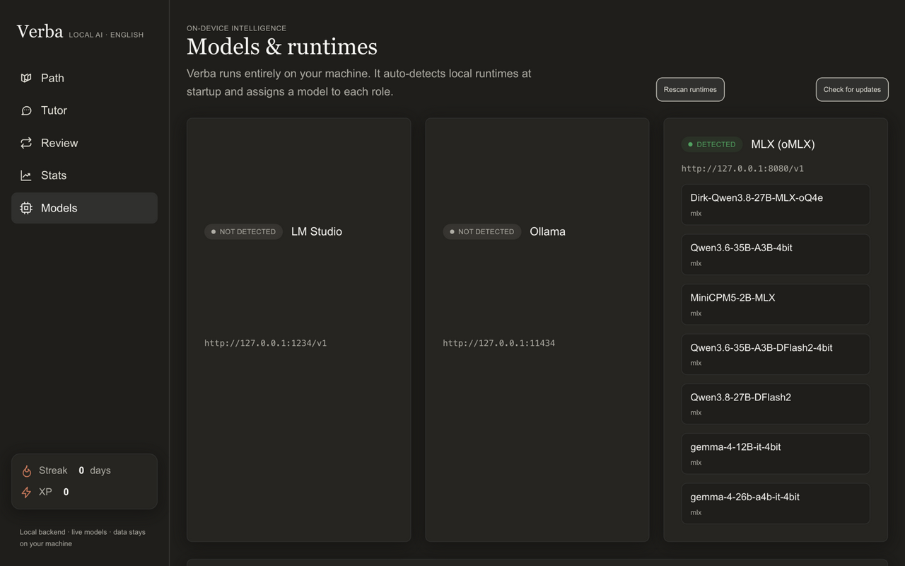

<div align="center">


# Verba

**Local-first AI English learning — 100% on your machine, powered by your own local LLM.**

[](https://github.com/LookUpMark/verba/actions/workflows/ci.yml)
[](https://github.com/LookUpMark/verba/releases)
[](LICENSE)

An open-source desktop app (Tauri v2 + FastAPI sidecar) in the spirit of Duolingo: a
structured A1→B2 path, six kinds of interactive exercises, a role-play tutor that
diagnoses every sentence you write, and spaced repetition that turns your mistakes
into drills. Everything runs on-device against a **local LLM** — LM Studio, Ollama
or oMLX (Apple Silicon). No cloud, no accounts, no telemetry.

| | |
|---|---|
|  |  |
|  |  |
|  | |

_Screenshots from a real run against the oMLX runtime: the A1→B2 path with generated and seeded missions, a lesson task generated on open by the local model, the tutor judging "I am agree / I have 25 years" live (40/100), the FSRS review queue, and the detected runtime with its models and role assignment._

</div>

## Why Verba

- **The whole loop, on-device** — placement → path → lessons → tutor → errors → drills → stats. Every step talks to a model you own; the tutor prompt and the judge prompt are separate by design, never merged.
- **Nothing is hardcoded** — no model id ships with the app. Runtimes are probed at startup, roles (tutor / judge / generator) auto-assign to what you actually have, and you can override any role in the Models screen.
- **Structured output or nothing** — every JSON a model produces goes through a repair-retry pipeline and per-field validation before it touches the app; the judge's findings merge with a deterministic rule pre-pass for the classic Italian-speaker calques.
- **Local-first for real** — the API binds to `127.0.0.1` only, requests are validated against a host/origin allowlist (no drive-by web pages), responses carry a strict CSP, and your learning data lives in `~/.verba/verba.db`.

## Quickstart

### macOS app (Apple Silicon)

Download `Verba_<version>_aarch64.dmg` from the [latest release](https://github.com/LookUpMark/verba/releases/latest), open it and drag Verba to Applications.

The build is **ad-hoc signed** (no Apple Developer certificate yet): macOS Gatekeeper stops the first launch, and on macOS Sequoia the old right-click → Open bypass is gone. Unblock it once:

1. Try to open Verba (it will be blocked).
2. **System Settings → Privacy & Security** → **Open Anyway** next to "Verba was blocked" → **Open**.

Or the terminal one-liner after moving the app to `/Applications`:

```bash
xattr -dr com.apple.quarantine /Applications/Verba.app
```

The **Check for updates** button in the Models screen talks to this repository's releases — it is the app's only optional network call. Data lives in `~/.verba/`.

> Intel Macs are not built yet (the sidecar needs a Rosetta cross-compile, planned for v0.2). Windows (`-setup.exe` / `.msi`, SmartScreen may warn — *More info → Run anyway*) and Linux (`.AppImage` / `.deb`) installers ship with every release.

### Set up a local runtime (required for the AI features)

Verba never downloads or hardcodes models — point it at whatever you already run:

| Runtime | You do | Verba does |
|---|---|---|
| **oMLX** (PrismML, Apple Silicon) | install once; models under `~/.omlx/models` | spawns `omlx serve` at startup and stops it on quit (only if Verba started it); Bearer auth and port are read from `~/.omlx/settings.json` |
| **LM Studio** | start the local server (`:1234`) and load a model | probes and lists its models |
| **Ollama** | `ollama serve`, then `ollama pull qwen3:8b` | probes `:11434` |

Any 7–8B instruct model works well (Qwen3, Gemma, Llama…). Then open **Models → Rescan runtimes**, check the auto-assigned roles (largest known size → judge, next → tutor, smallest → generator), adjust if you like, and start learning. While Verba runs without a runtime it re-scans on its own the moment one shows up; path, review and stats work on seeded content in the meantime.

### From source

Prerequisites: Python 3.12 (`uv` recommended), Rust stable; on Linux also
`libwebkit2gtk-4.1-dev libappindicator3-dev librsvg2-dev patchelf`.

```bash
uv venv && uv pip install -e . && verba     # backend on http://127.0.0.1:8000 — the UI is served at /
ruff check src tests && python -m pytest -q # lint + contract suite
pip install -e . -c constraints.txt pyinstaller
python desktop/build-sidecar.py             # → desktop/src-tauri/binaries/
cd desktop/src-tauri && cargo check --locked
cargo tauri build                           # installers for this OS
```

The UI is a single `index.html` wired to the API when served by the backend; opened as a file it falls back to an offline demo. Layout: `src/verba/` (FastAPI app, providers, pipelines, API), `desktop/` (Tauri shell + PyInstaller sidecar), `.github/workflows/` (CI on 3 OS; release on `v*` tags). The full blueprint — provider layer, pipelines, scoring, FSRS, data model — is [`architecture.md`](architecture.md).

### Verify your setup

```bash
curl -s http://127.0.0.1:8000/api/runtimes | python3 -m json.tool   # models + roles
curl -s http://127.0.0.1:8000/api/path | python3 -m json.tool       # 11 missions A1-B2

# one mission end to end (tasks are generated by your model on first open)
MID=$(curl -s http://127.0.0.1:8000/api/path | python3 -c "import json,sys;print(json.load(sys.stdin)['current'])")
curl -s -X POST http://127.0.0.1:8000/api/missions/$MID/start | python3 -m json.tool
#    … grade via POST /api/attempts {task_id, answer, latency_ms}, then
curl -s -X POST http://127.0.0.1:8000/api/missions/$MID/complete -H 'Content-Type: application/json' -d '{"correct":3,"total":6}'

# tutor chat over SSE — the judge should flag both planted errors
SID=$(curl -s -X POST http://127.0.0.1:8000/api/chat/sessions -H 'Content-Type: application/json' -d '{"scenario":"airport"}' | python3 -c "import json,sys;print(json.load(sys.stdin)['id'])")
curl -s -X POST http://127.0.0.1:8000/api/chat/sessions/$SID/messages -H 'Content-Type: application/json' -d '{"text":"I am agree with you, and I have 25 years."}' >/dev/null
curl -N http://127.0.0.1:8000/api/chat/sessions/$SID/stream
#    → token … message_end, then a diagnosis event; errors become drills via
#      POST /api/review/generate (or the Review screen button)
```

## Roadmap

See [`architecture.md` §11](architecture.md). Next up (v0.2): whisper.cpp STT with real pronunciation scoring, Intel Mac sidecar, guided runtime/model setup, update flow polish.

## License

[MIT](LICENSE)
